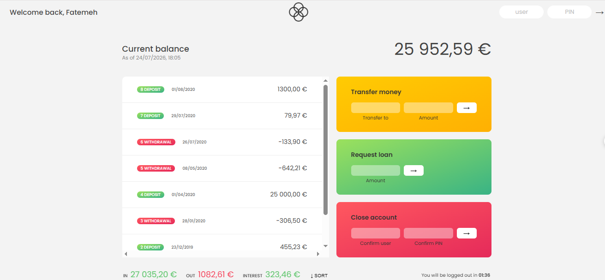

# 💳 Bankist App

A modern banking application built with **Vanilla JavaScript** that simulates the core functionality of an online banking system.

This project was developed as part of learning advanced JavaScript concepts and focuses on building interactive user interfaces, managing application state, and working with modern JavaScript (ES6+) features. It uses mock data to simulate real banking operations without requiring a backend or database.

---

## 🚀 Live Demo

🔗 https://your-demo-link

---

## 📸 Screenshots

### Dashboard



---

## 🔄 Application Flow


---

## ✨ Features

- Secure login with predefined demo accounts
- Display account balance and transaction history
- Transfer money between accounts
- Request loans
- Close an account
- Sort transactions
- Automatic logout timer
- Human-readable transaction dates
- Currency formatting using the Internationalization API
- Responsive user interface

---

## 🧪 Demo Accounts

| Username | PIN |
| -------- | --- |
| fa | 1111 |
| jd | 2222 |

> **Note:** This application uses mock data for demonstration purposes.

---

## 🛠 Tech Stack

- HTML5
- CSS3
- Vanilla JavaScript (ES6+)
- DOM Manipulation
- Array Methods
- Event Handling
- Date & Time API
- Internationalization API (`Intl`)
- Timers

---

## 📚 Key Concepts Practiced

This project provided hands-on experience with:

- Working with objects and arrays
- DOM manipulation
- Event-driven programming
- State management
- Array methods (`map`, `filter`, `reduce`, `find`, `sort`)
- Closures
- Timers (`setTimeout`, `setInterval`)
- Date formatting
- Number and currency formatting with `Intl`
- Writing modular and maintainable JavaScript code

---

## ⚠️ Limitations

- Uses mock data instead of a real database
- No backend or server-side functionality
- No real authentication system
- Data is not persisted after page refresh
- Transactions are simulated entirely on the client side

---

## 📁 Project Structure

```text
bankist-app/
│
├── index.html
├── style.css
├── script.js
├── img/
│   ├── icon.png
│   ├── logo.png
   ├── screenshot.PNG
│   └── bankist-flowchart.png
└── README.md
```

---

## 📄 License

This project was created for educational purposes as part of learning modern JavaScript.

## 👩‍💻 Author

**Fatemeh Abedniya**
